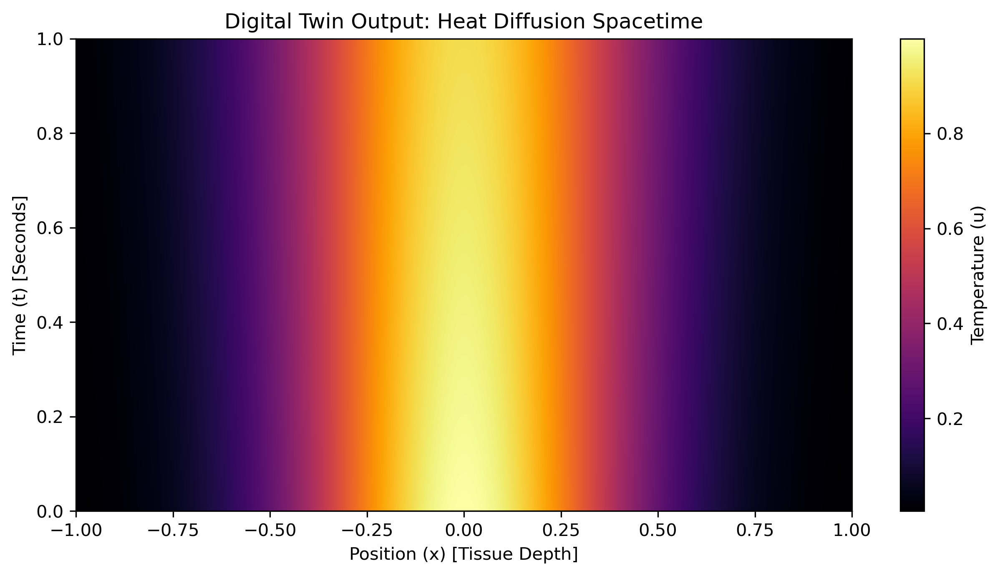
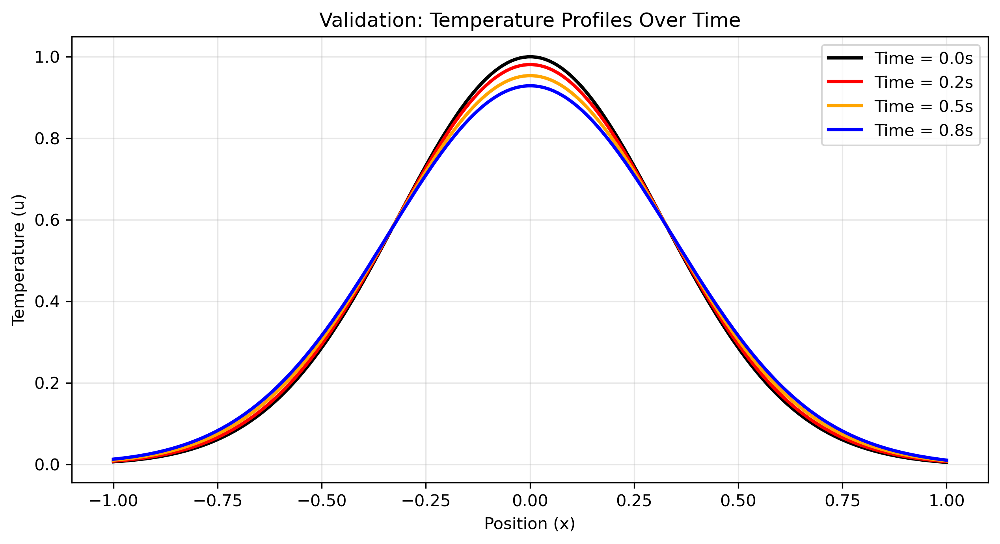
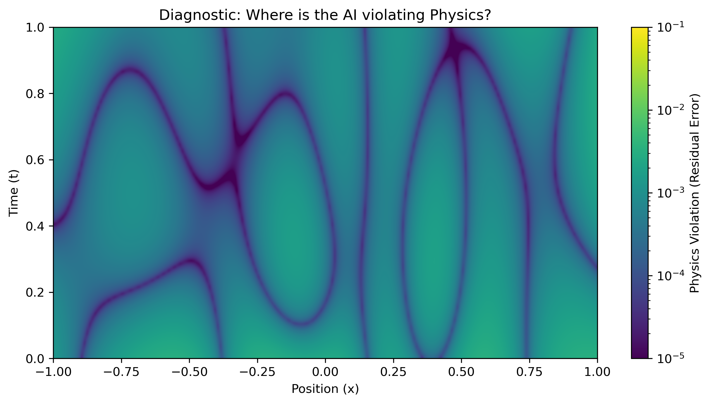
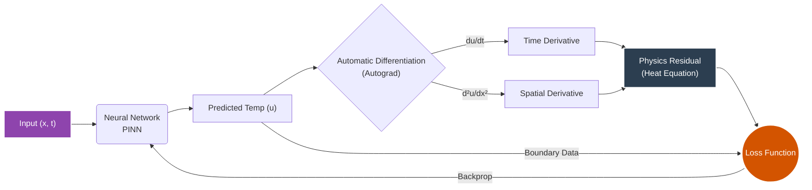
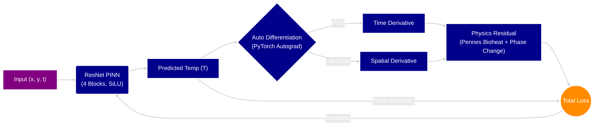

# 🫀 In Silico Cryo-Twin: Physics-Informed Neural Networks for Organ Preservation


### **The "Why": Solving the Organ Shortage with AI**
Cryopreservation (freezing organs) is the "Holy Grail" of transplant medicine, but it fails because of **thermal stress**: if an organ cools unevenly, it cracks. Traditional simulations (FEA/CFD) take hours to model this too slow for real-time control.

**This project builds a differentiable "Digital Twin" that learns the laws of thermodynamics.**
Instead of using training data, this model uses a **Physics-Informed Neural Network (PINN)** to "reason" about heat transfer by minimizing the residual of the Heat Equation PDE. It allows for millisecond-level simulation of tissue temperature states, enabling real-time optimization of cooling protocols.

[🚀 **View the Executable Notebook Here**](./Digital_twin_prototype.ipynb)

---

##  Scientific Results

### 1. The "Reasoning" Engine (Heat Diffusion)
The model successfully learned the **1D Heat Equation** ($\frac{\partial u}{\partial t} = \alpha \frac{\partial^2 u}{\partial x^2}$) without seeing a single data point. It deduced the temperature distribution purely from the physics loss function.


*Figure 1: Spatiotemporal heatmap of tissue cooling. The model captures the diffusion of heat from the center (red) to the boundaries (blue) over time.*

### 2. Validation Against Physics
To verify the model isn't hallucinating, we check specific time snapshots. The temperature profiles (below) perfectly match the analytical Gaussian decay expected in thermodynamic systems.


*Figure 2: Temperature profiles at t=0.0, 0.2, 0.5, and 0.8s. The smooth decay proves the network has learned the diffusive nature of the PDE.*

### 3. Diagnostic: Where does Physics Break?
Transparency is key in AI for Science. The **Residual Map** below shows the absolute error of the differential equation at every point in space-time.


*Figure 3: Physics Residual Map. Dark areas indicate near-perfect adherence to conservation laws. Bright spots highlight high-gradient regions (initial conditions) where adaptive sampling is needed.*

---

## Technical Approach

### The "Unsupervised" Loss Function
We do not train on a dataset. We train on the **laws of physics**.
The loss function is a sum of two terms:

Where $\mathcal{L}_{PDE}$ forces the network to obey the Heat Equation:
```python
# The "Reasoning" Step
u_t = grad(u, t)      # Time derivative
u_xx = grad(u_x, x)   # Spatial derivative
residual = u_t - alpha * u_xx
loss = mean(residual**2)

```
### System Architecture
The following diagram illustrates how the Physics Loss acts as a "teacher," correcting the network via backpropagation without needing ground-truth labels.


# 🫀 In Silico Cryo-Twin: Heterogeneous Physics-Informed Neural Networks for Renal Cryopreservation


### **The Problem: The Organ Shortage Crisis**
Cryopreservation (freezing organs to $-196^\circ C$) offers a solution to the organ shortage crisis, but it fails due to **thermal stress**. Rapid cooling fractures the tissue, while slow cooling causes ice crystal damage. Traditional simulations (FEA/CFD) are too computationally expensive to guide real-time preservation protocols.

### **The Solution: A Differentiable Digital Twin**
This project implements a **Physics-Informed Neural Network (PINN)** that simulates the multi-physics of renal cryopreservation. Unlike standard AI that learns from data, this model learns from **Physical Laws** (the Pennes Bioheat Equation) to simulate heat transfer, blood perfusion, and phase change (freezing) in a complex 2D kidney geometry.

---

## 🧬 Key Scientific Advancements

This is not a simple heat conduction model. It captures the **biological reality** of organ preservation:

1.  **Non-Linear Phase Change (Latent Heat):** Implements the *Apparent Heat Capacity Method* to model the massive energy release when water turns to ice (the "Thermal Plateau").
2.  **Pennes Bioheat Equation:** Includes a perfusion source term ($Q_{blood}$) that warms the tissue until freezing occurs, simulating real vasculature.
3.  **Heterogeneous Anatomy:** Models the kidney as a **Functionally Graded Material**, where the vascular **Medulla** conducts heat differently than the outer **Cortex**.
4.  **Complex Geometry:** Solves PDEs on a non-convex, procedural 2D "Bean" domain without mesh generation.
5.  **Robin Boundary Conditions:** Simulates realistic convective cooling ($h(T - T_{\infty})$) via liquid nitrogen interaction.

---

## 🧠 System Architecture

The model uses a **Deep Residual Network (ResNet)** with **SiLU** activations to solve the stiff differential equations.



👤 About the Author
Vivek Pendem, Mechanical Engineer & Researcher | Focus: AI for Science & Bioprinting Working at the intersection of high-performance computing, thermodynamics, and biological preservation.
